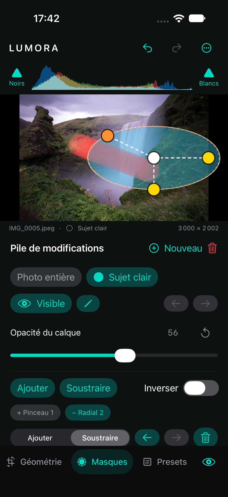

# Pile de modifications

Lumora présente désormais le développement comme une pile ordonnée. Le premier niveau, **Photo entière**, est un calque implicite dont le masque est un rectangle couvrant toute l’image. Les niveaux suivants sont des `AdjustmentLayer` munis d’un masque composé de pinceaux, gradients ou mattes Vision.

La sélection d’un calque reste active lorsque l’utilisateur ouvre Lumière, Couleur, Courbes, Mélangeur, Grading, Effets ou Détail. Les changements sont enregistrés dans ce calque, participent à Undo/Redo et sont recalculés depuis l’original pour l’aperçu comme pour l’export. Le nom du calque actif apparaît sous la photographie.

Chaque calque masqué peut être renommé, temporairement masqué, déplacé vers une application plus tôt ou plus tard et mélangé avec une opacité de 0 à 100 %. Toutes ces opérations sont persistées et participent à Undo/Redo. Dans le sélecteur horizontal, la pile se lit de gauche à droite : un déplacement vers la droite applique le calque plus tard.

À l’intérieur d’un calque, chaque composante peut passer d’Ajouter à Soustraire, être réordonnée ou supprimée. Le radial sélectionné expose un centre et deux rayons directement sur la photographie ; le linéaire expose son centre et sa direction. Un geste complet forme une seule opération d’historique. Voir [Édition directe](MaskEditing.md).

Le moteur applique d’abord l’optique et le développement Photo entière, puis la géométrie commune. Pour chaque calque masqué visible, il calcule un nouveau développement à partir de l’image produite par le niveau précédent et le mélange avec cette image au moyen de la matte modulée par l’opacité. L’ordre de la pile a donc un effet réel.

Optique, rotation, perspective et recadrage restent au niveau du document : les rendre locaux créerait plusieurs repères spatiaux incompatibles pour les masques. Ouvrir Optique ou Géométrie sélectionne donc automatiquement Photo entière.

Le stockage conserve volontairement la clé JSON historique `masks` et migre les anciens champs locaux Clarté/Netteté vers Effets/Détail. Les sidecars dépourvus des nouveaux champs sont chargés comme des calques visibles à 100 % d’opacité. Les sidecars existants restent donc lisibles.
