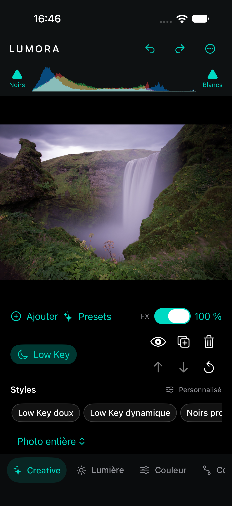

# Creative FX — guide d’utilisation

État au 22 septembre 2026, après l’ajout de Darken / Lighten Center.

## Pile et masques

Le panneau **Creative** permet d’ajouter, désactiver, dupliquer, réordonner, réinitialiser et supprimer un effet. Les six actions de l’effet sélectionné sont directement accessibles à droite de son nom, sur deux rangées d’icônes avec une cible tactile de 44 points : œil, duplication, suppression, ordre précédent/suivant et réinitialisation. Le menu « … » est supprimé. Chaque instance conserve ses réglages, son opacité et son éventuel masque. L’ordre de la pile est l’ordre du traitement : déplacer un effet peut changer le résultat. Le bypass Creative sert à comparer l’aperçu et n’est pas exporté.

Les effets utilisent les masques existants, y compris leurs composantes ajoutées/soustraites et leur inversion. Un masque absent, masqué ou d’opacité nulle suspend l’effet qui le référence. Les changements passent par Undo/Redo et sont enregistrés dans le document.

Choisir un look remplit les réglages de l’effet. Changer une valeur affiche **Custom** ; revenir exactement aux valeurs du look le reconnaît de nouveau. Ces looks intégrés sont distincts des [presets personnels du document](Presets.md).

## Effets disponibles

High Key, Low Key, Film Grain, Tonal Contrast, Detail Extractor, Glamour Glow, Bleach Bypass, Pro Contrast, Cross Processing, Film Emulation, Silver B&W, Silver Toning et Darken / Lighten Center.

Le panneau **Effets** reste disponible pour Texture, Clarté, Correction du voile, Vignette et la quantité de grain du développement global/local. Son Grain partage le moteur de Film Grain ; activer les deux additionne le grain.

## Film Emulation

Sept réponses originales : Neutral Negative, Warm Portrait, Vivid Chrome, Muted Cinema, Faded Negative, Vintage Color et Dense Slide. Elles proposent des réponses tonales et colorées, sans générer de grain. Dense Slide a fait l’objet d’un raffinement de preset approuvé séparément ; les autres types et le renderer n’ont pas été modifiés par ce raffinement.

## Silver B&W

La couleur d’origine détermine la densité du gris. **Film Response** choisit parmi Neutral Silver, Fine Grain Response, Portrait Silver, Classic Panchromatic, High Contrast Film, Soft Orthochromatic et Documentary Silver. Fine Grain Response décrit une réponse tonale/spectrale et ne produit pas de grain.

Le filtre photographique possède une teinte continue et une force. Les raccourcis jaune, orange, rouge, vert et bleu modifient ces mêmes paramètres. Il change les densités selon les couleurs originales ; il ne teinte pas le résultat monochrome.

Amount, Brightness, Contrast et Structure forment les réglages principaux. Dynamic Brightness, Soft Contrast, Blacks et Whites sont avancés. Amount=0 conserve strictement la couleur d’entrée ; Amount=100 produit un monochrome neutre. Les valeurs intermédiaires conservent une partie de la couleur.

Looks : Neutral Silver, Soft Portrait, Fine Art, Classic Film, High Structure, Dark Drama, Soft Silver et Hard Documentary.

## Silver Toning

Silver Toning colore le tirage en fonction de sa densité. Il accepte aussi une image couleur sans la convertir implicitement en N&B. Le workflow principal est **Silver B&W → Silver Toning**, avec un Film Grain ajouté explicitement si souhaité.

| Contrôle | Comportement |
|---|---|
| Amount | Mélange final ; 0 = identité stricte |
| Toner | Neutral, Selenium, Sepia, Copper, Gold, Platinum, Cool Silver, Warm Silver ou Split Silver |
| Strength | Intensité de toute la coloration, papier inclus ; 0 = identité |
| Balance | Négatif : réponse argent concentrée dans les ombres ; positif : étendue vers les lumières |
| Shadow / Highlight Strength | Intensités séparées avec transitions continues |
| Silver Tone | Contribution du virage de l’image argentique |
| Paper Tone | Papier froid si négatif, chaud si positif, neutre à 0 ; surtout visible dans les blancs |
| Shadow / Highlight Tone | Teintes indépendantes, affichées pour Split Silver |

Neutral retourne l’entrée inchangée. Pour observer uniquement le papier, choisir un autre toner et mettre Silver Tone à 0. Pour observer uniquement l’argent, mettre Paper Tone à 0.

Looks : Neutral Print, Subtle Selenium, Deep Selenium, Classic Sepia, Soft Sepia, Copper Print, Cool Gold, Platinum Print, Warm Silver, Cool Silver et Split Warm/Cool. Platinum et Subtle Selenium restent volontairement discrets.

**Validation visuelle en attente** : Deep Selenium donne une dominante mauve perceptible sur les carnations dans les planches de validation. Ce quality WARN est conservé ; aucun preset n’a été automatiquement corrigé. Le [rapport complet](../TestArtifacts/SilverToningValidationReport.md) distingue les résultats techniques et l’inspection photographique.

## Comparer les ordres et le détail

- Silver B&W → Silver Toning conserve le virage ; Silver Toning → Silver B&W le neutralise lorsque B&W est à Amount=100.
- Film Emulation → Silver B&W permet à la couleur du film d’influencer la conversion monochrome.
- Film Grain avant ou après le virage peut changer le résultat. Lumora respecte cet ordre.
- Le zoom ordinaire agrandit l’aperçu. L’inspecteur explicite **100 %** rend une région à la résolution source ; il permet notamment de regarder le grain et les détails.

Les kernels compatibles HDR ne signifient pas que l’affichage et l’export sont HDR/EDR. Voir [les limites du pipeline](Rendering.md), [l’architecture Creative](../Docs/CREATIVE_FX.md) et [le protocole de validation](../Docs/VISUAL_VALIDATION.md).

## Darken / Lighten Center

Déplacer la poignée centrale sur la photographie pour diriger l’attention vers une zone précise. **Center** et **Border** règlent indépendamment l’exposition en stops (−2 à +2 EV). Un centre positif avec un bord neutre éclaire le sujet ; un bord négatif assombrit son environnement. Un centre négatif et un bord positif inversent cette intention. Amount mélange le résultat à l’entrée.

**Size** règle le rayon par rapport au petit côté de l’image. **Shape** étire horizontalement ou verticalement une ellipse à aire constante ; zéro donne un cercle. **Rotation** tourne cette ellipse. **Feather** adoucit sa transition, avec une largeur minimale même à zéro pour éviter un bord dur. Si Center et Border ont la même valeur, le résultat est une exposition uniforme.

La poignée, le contour et la limite de feather apparaissent pour l’instance sélectionnée dans Creative. Le zoom et le déplacement de l’aperçu ne changent pas le centre enregistré. Un drag crée une seule opération Undo. **Position précise X / Y** donne accès aux coordonnées normalisées (0 en haut/gauche, 1 en bas/droite), au millième. Les réglages EV ont un pas de 0,01. Les overlays ne sont pas exportés.

Looks : **Subtle Focus, Portrait Focus, Dark Surround, Light Center, Wide Focus, Narrow Focus, Off-Center Drama, Reverse Focus**. Ils ne détectent pas automatiquement le sujet. Repositionner le centre selon la composition produit un réglage Custom. Une correction forte peut écrêter les blancs à l’export SDR ; le moteur ne compense pas cette exposition par une protection cachée.

Les masques limitent l’effet via la même composition que les autres Creative FX. Plusieurs instances sont possibles. Le repère suit l’image développée après géométrie : recadrer le document peut donc déplacer le centre par rapport au contenu d’origine. Voir le [rapport et les planches décentrées](../TestArtifacts/DarkenLightenCenterValidationReport.md) avant toute approbation photographique.

Les tests UI des actions directes, duplication/Undo/suppression et inspecteur 100 % passent sur iPhone 18 Pro simulé (iOS 27). La ligne nom/calque/format/résolution est masquée dans Creative.

