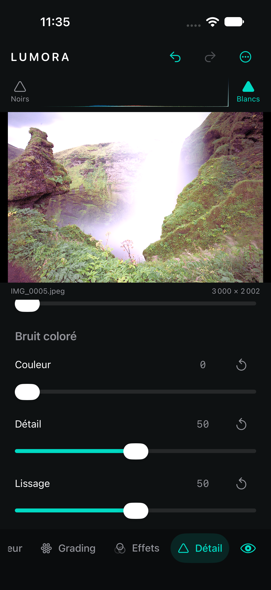

# Détail — sixième étape

## Utilisation

Le panneau **Détail** regroupe trois familles de réglages.

**Netteté** :

- **Gain**, 0…150, active le renforcement de luminance.
- **Rayon**, 0,5…3 px, règle la largeur des contours renforcés.
- **Détail**, 0…100, ajoute une seconde passe à rayon fin.
- **Masquage**, 0…100, réserve progressivement la netteté aux contours et protège les aplats.

**Réduction du bruit** :

- **Luminance** définit le seuil du lissage local sensible aux contours.
- **Détail** restitue une partie de la netteté pendant ce traitement.
- **Contraste** renforce à petit rayon la structure conservée après débruitage.

**Bruit coloré** :

- **Couleur** dose le mélange avec la chrominance filtrée.
- **Détail** conserve progressivement la chrominance fine originale.
- **Lissage** règle le rayon spatial de la chrominance filtrée.

Les contrôles secondaires n’altèrent pas l’image tant que Gain, Luminance ou Couleur reste à zéro. Leurs valeurs par défaut peuvent donc être préparées sans modifier un développement existant.

## Traitement

Le pipeline applique Texture, Clarté et Correction du voile avant le détail. La réduction du bruit coloré vient en premier, suivie de la réduction du bruit de luminance, puis de la netteté. Vignette et Grain sont appliqués ensuite afin que le grain ajouté ne soit pas supprimé immédiatement par le débruitage.

La réduction de luminance utilise `CINoiseReduction`, qui lisse les variations sous un seuil tout en reconnaissant les contours. La restitution de détail pilote sa netteté interne. Le contraste de bruit est un renforcement local à rayon court, pas une modification du contraste global.

La réduction colorée sépare mathématiquement luminance et chrominance. Seule la chrominance passe par un flou gaussien ; elle est ensuite recombinée avec la luminance intacte puis mélangée à l’original. Cette construction évite d’adoucir les détails purement lumineux.

La netteté utilise `CISharpenLuminance`, ce qui évite les franges colorées. Une passe principale suit Rayon ; une seconde passe plus fine suit Détail. Le masquage est construit par détection de contours, seuil progressif et fusion entre l’original et l’image renforcée.

Toutes les opérations conservent l’étendue, clampent les flous aux bords et utilisent le contexte Core Image Metal lorsque disponible. Le même graphe sert à l’aperçu et à l’export pleine résolution.

Pour un RAW, `CIRAWFilter` conserve actuellement son développement Apple par défaut. Les réglages de ce panneau constituent une passe après développement et restent neutres à zéro : Lumora n’ajoute donc pas automatiquement une seconde netteté ou un second débruitage. L’exposition des paramètres natifs RAW demandera une étape séparée afin d’éviter les doubles traitements.

## Modèle et migration

`DetailSettings` contient `SharpeningSettings`, `NoiseReductionSettings` et `ColorNoiseReductionSettings`. Toutes ces structures sont Codable, Sendable et Equatable. Leur décodage accepte les documents anciens et les objets JSON partiels. Les valeurs sont bornées et les valeurs non finies reviennent au défaut propre au curseur.

Chaque geste crée une seule commande Undo/Redo. Les réglages sont persistés avec le document et restaurés au lancement.

## Validation

Les **48 tests du cœur** passent, dont quatre nouveaux tests consacrés au détail. Ils vérifient migration, JSON partiel, bornes, historique, diminution mesurée de la variance lumineuse, réduction mesurée du bruit chromatique avec préservation de luminance, netteté réelle des contours, protection des aplats par le masque et conservation des dimensions.

Build iOS Simulator réussi sans warning Swift. L’avertissement Xcode App Intents non bloquant reste présent. Les réglages doivent encore être profilés et calibrés sur des RAW bruités de plusieurs appareils et sur des images 48 MP réelles.

Le parcours XCTest UI complet passe sur iPhone 18 Pro / iOS 27 Simulator. Il vérifie Gain, Undo/Redo, Luminance et leur restauration après relancement, en plus des outils des étapes précédentes.

Résultats : `/tmp/lumora-detail-tests-final.log`, `/tmp/lumora-detail-build.log`, `/tmp/lumora-detail-ui2.log` et `/tmp/LumoraDetailUITests2.xcresult`.
