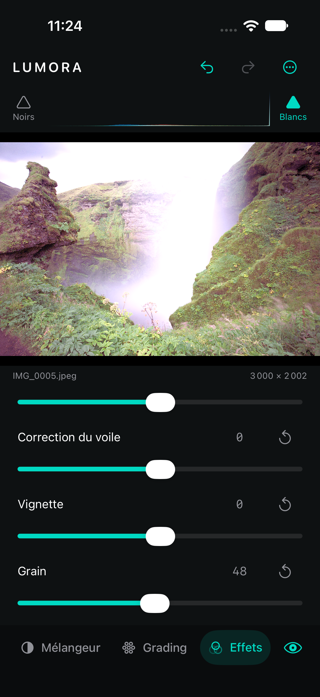

# Effets et Creative FX

Le panneau **Effets** porte les réglages du développement global ou du calque sélectionné. Le panneau **Creative** porte une pile indépendante d’effets réordonnables : voir [le guide Creative FX](CreativeEffects.md).

## Utilisation

Faire défiler la barre inférieure jusqu’à **Effets**. Cinq réglages sont disponibles :

- **Texture** renforce ou adoucit les détails fins avec un rayon court.
- **Clarté** agit sur le contraste local des fréquences intermédiaires avec un rayon adapté à la taille de l’aperçu.
- **Correction du voile** combine une estimation locale à grand rayon avec une correction mesurée du point noir, du contraste et de la saturation.
- **Vignette** éclaircit avec une valeur positive et assombrit avec une valeur négative.
- **Grain** règle la quantité du moteur photographique partagé `FilmGrainEngine`. Pour contrôler taille, dureté, structure et chroma, utiliser Film Grain dans Creative.

Texture, Clarté, Correction du voile et Vignette vont de −100 à 100. Grain va de 0 à 100. Le réglage fin, le double toucher, le reset, Undo/Redo et la persistance suivent le comportement des autres curseurs.

## Pipeline et qualité

Les effets sont appliqués après la LUT de ton, courbes, HSL et color grading. Texture, Clarté et Correction du voile précèdent le [panneau Détail](Detail.md) ; Vignette le suit. Le grain global et local est appliqué après la géométrie et les développements masqués, avant la pile Creative. Ils restent donc des opérations spatiales Core Image et ne forcent pas la reconstruction de la LUT lorsqu’un curseur Effets change. Le même graphe sert aux aperçus 960/2048 px et à l’export pleine résolution ; les rayons de Clarté et de Correction du voile suivent la dimension de l’image.

Texture utilise un renforcement à rayon 1,25 px. Clarté emploie un rayon compris entre 7 et 28 px. La Correction du voile travaille entre 18 et 70 px puis ajuste modérément contraste, saturation et luminosité. Ces trois outils ne sont donc pas des alias. Les versions négatives mélangent une image floutée à l’original avec un poids borné.

Tous les filtres conservent l’étendue de l’image. Les flous clampent les bords avant de recadrer, ce qui évite une bordure transparente. Le traitement reste GPU lorsque le contexte Metal est disponible.

La Correction du voile est une approximation photographique locale, pas une estimation physique complète de la lumière atmosphérique. Le curseur Grain du panneau Effets conserve une interface simple ; Film Grain dans Creative expose les contrôles supplémentaires du même moteur. Activer les deux additionne leurs contributions. Dans Creative, déplacer Film Grain avant ou après Silver B&W, Silver Toning ou un autre effet change intentionnellement le résultat.

## Modèle et migration

`EffectsSettings` est Codable, Sendable et Equatable. Une migration additive donne des effets neutres aux documents existants. Les valeurs non finies reviennent à zéro et toutes les plages sont bornées. Une interaction continue forme une seule commande d’historique.

## Validation actuelle

Le dernier passage du cœur comprend 97 tests réussis (22 septembre 2026). Les bancs Creative distinguent invariants obligatoires et qualité photographique ; les rapports et commandes sont décrits dans [Visual Validation](../Validation/Documentation/VISUAL_VALIDATION.md).

## Historique de la cinquième étape

Les **44 tests du cœur** passent. Les quatre nouveaux tests vérifient la migration, la sérialisation, les bornes, l’historique, l’identité après reset, la différence réelle entre Texture et Clarté, l’assombrissement spatial de la vignette, l’action de la Correction du voile, le grain et la conservation des dimensions.

Build iOS Simulator réussi sans warning Swift. L’avertissement non bloquant d’extraction App Intents demeure, l’application n’utilisant pas ce framework. Les performances sur une image 48 MP et un appareil physique restent à mesurer.

Le parcours XCTest UI complet réussit sur iPhone 18 Pro / iOS 27 Simulator : réglages, Undo/Redo, restauration après relancement et absence de régression sur les panneaux précédents. Le parcours d’export séparé réussit également.

Résultats : `/tmp/lumora-effects-tests-final.log`, `/tmp/lumora-effects-build-final.log`, `/tmp/lumora-effects-ui.log` et `/tmp/LumoraEffectsUITests2.xcresult`.
