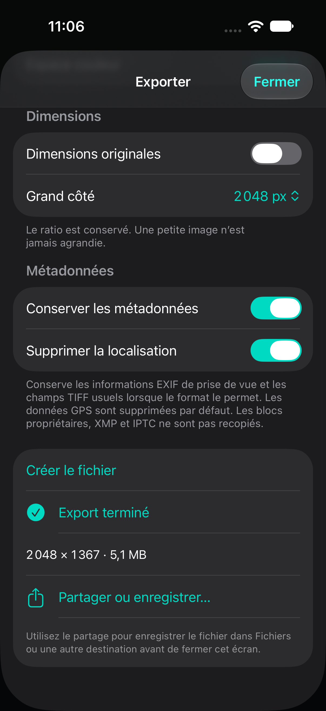

# Export pleine résolution

Depuis le menu supérieur, choisir **Exporter**, régler les options puis **Créer le fichier**. Après le rendu, **Partager ou enregistrer…** ouvre la feuille système iOS, notamment pour enregistrer dans Fichiers. Le fichier temporaire doit être enregistré avant de fermer l’écran. Changer les options invalide le résultat précédent.

## Options

- JPEG, HEIC, PNG et TIFF selon les encodeurs annoncés par ImageIO ; toute erreur d’encodage est présentée explicitement.
- Qualité JPEG/HEIC de 10 à 100 %.
- Dimensions originales, ou plafond du grand côté : 1024, 2048, 3000, 4096, 6000 ou 8000 pixels. Le ratio est conservé, sans agrandissement.
- Profil ICC sRGB ou Display P3, incorporé à la sortie.
- Conservation facultative des informations EXIF de prise de vue et de champs TIFF descriptifs usuels.
- Suppression du dictionnaire GPS activée par défaut. Les blocs propriétaires MakerNote, XMP et IPTC ne sont pas recopiés ; les commentaires libres ne font pas l’objet d’une analyse sémantique.

La conservation des métadonnées dépend du format de destination et des capacités de son encodeur. Les dimensions et l’orientation sont mises à jour. Désactiver la conservation supprime les métadonnées source ; le profil et les propriétés techniques nécessaires à l’image restent présents.

## Traitement

L’ouverture de l’écran fige les réglages du document. Un moteur indépendant relit l’original immuable : CIImage orientée pour les images développées, CIRAWFilter pour les RAW pris en charge. Aucun aperçu 2048 px n’est utilisé comme source d’export.

La réduction éventuelle utilise Lanczos, puis le même graphe de balance des blancs, exposition, ton, courbes, HSL et grading que l’aperçu. Le JPEG est composé sur fond blanc pour traiter la transparence. Un bitmap final est encodé dans un dossier unique ; le fichier n’est publié qu’après finalisation. L’original n’est jamais écrasé.

La progression indique les étapes décodage, rendu, encodage et fin. L’annulation est coopérative : un appel Core Image ou ImageIO déjà engagé doit finir avant le nettoyage. Les exports annulés ou en erreur sont supprimés ; fermer l’écran ou créer un nouveau résultat supprime le précédent fichier temporaire.

## Limites

Toutes les sorties actuelles sont **SDR 8 bits**, y compris TIFF. Choisir Display P3 ne récupère pas les couleurs déjà écrêtées par la LUT sRGB 32³. Pas d’export HDR, de TIFF 16 bits, de traitement par lots ni de sauvegarde PhotoKit directe.

Le rendu final peut allouer un bitmap pleine résolution et des ressources GPU importantes. Les photos 48 MP et RAW de différents boîtiers restent à mesurer sur iPhone physique. Le décodeur RAW applique son développement Apple par défaut ; les contrôles RAW natifs ne sont pas encore exposés.

## Validation

Les 40 tests du cœur passent sur macOS avec Core Image. Les sept nouveaux tests couvrent :

- export 2400 px malgré un aperçu limité à 2048 px et conservation exacte des octets originaux ;
- encodage et relecture de tous les formats disponibles sur l’hôte ;
- dimensions, absence d’agrandissement, orientation EXIF et profils ICC ;
- métadonnées GPS conservées, supprimées par défaut ou entièrement désactivées ;
- cohérence des histogrammes aperçu/export avec plusieurs réglages ;
- annulation aux trois étapes, sans fichier résiduel.

Le parcours de retouche existant a également réussi sur simulateur iPhone 18 Pro / iOS 27. Les codecs et performances sur appareil physique restent à valider.

Le nouveau test UI réussit également : import Photos, sélection PNG/2048 px, résultat 2048 × 1367 et ouverture de la feuille de partage. Les deux parcours UI ont été validés dans des exécutions séparées. Build iOS réussi, aucun warning Swift ; avertissement App Intents non bloquant inchangé.

Résultats de cette itération : `/tmp/lumora-export-tests.log`, `/tmp/LumoraExportUITests.xcresult` (parcours de retouche réussi), `/tmp/LumoraExportUITests4.xcresult` (parcours d’export réussi).
