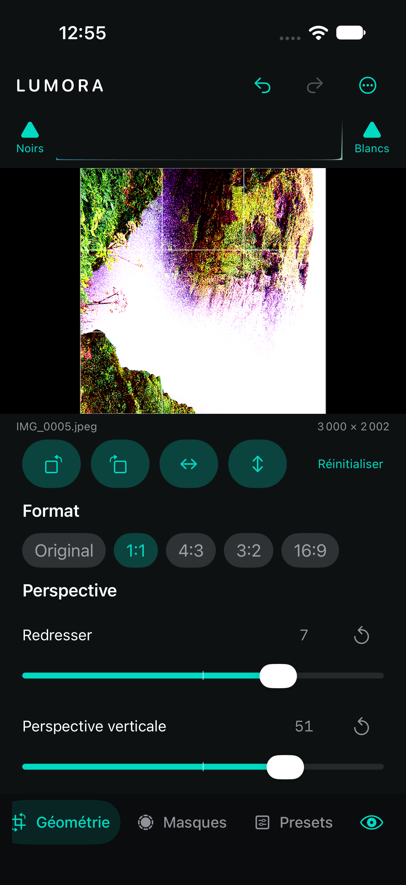

# Géométrie et recadrage — neuvième étape

## Transformations

Le panneau **Géométrie** propose les rotations gauche/droite par quarts de tour, les miroirs horizontal et vertical, ainsi qu’un redressement continu de −15° à +15°. Il ajoute une correction de perspective verticale et horizontale, un réglage d’aspect, une échelle de 100 à 150 %, et des décalages X/Y. Toutes ces opérations font partie de `EditState` : elles sont non destructives, sérialisées dans le sidecar, annulables et rétablies avec le même historique que les réglages photographiques.

Le redressement agrandit l’image du facteur minimal nécessaire avant la rotation puis la recadre à son étendue initiale. Les quatre coins restent donc couverts sans étirement des bords ni pixels transparents. Les rotations à 90° échangent réellement largeur et hauteur et ramènent toujours l’origine Core Image à `(0, 0)`.

La perspective transforme les quatre coins avec `CIPerspectiveCorrection`, puis normalise l’étendue produite. L’aspect, l’échelle et les décalages sont appliqués ensuite avec une image étendue aux bords avant le recadrage, afin de ne pas introduire de transparence. Une grille de tiers apparaît sur le canevas tant que le panneau est ouvert ; elle épouse les limites de l’image affichée, y compris lorsqu’elle est verticale ou carrée.

## Recadrage

Les formats **Original**, **1:1**, **4:3**, **3:2** et **16:9** calculent le plus grand rectangle centré compatible avec l’image déjà tournée. Le réglage **Recadrage** resserre ensuite ce rectangle jusqu’à 80 %, tandis que les positions horizontale et verticale le déplacent dans toute la zone encore disponible. Les coordonnées restent normalisées dans l’état de développement : un même sidecar conserve donc le cadrage entre l’aperçu réduit et l’original pleine résolution.

La géométrie intervient à la fin du graphe, après les corrections optiques, la couleur, le détail, la vignette et le grain. Le redimensionnement demandé à l’export est calculé après le crop ; la limite choisie s’applique ainsi au fichier réellement produit. ImageIO reçoit les dimensions finales et une orientation normalisée.

## Validation et limites

Neuf tests de géométrie vérifient la migration, les valeurs non finies, les bornes, la sérialisation, l’historique, les conversions du redressement et de la perspective automatiques, la pondération des quadrilatères, les coordonnées des poignées directes, l’échange des dimensions à 90°, le ratio carré, la modification réelle des pixels, l’étendue finie, l’opacité des quatre coins et l’égalité des dimensions entre aperçu et export. Le test général d’export applique aussi la perspective. La suite du cœur compte désormais **82 tests réussis**.

Le parcours XCTest complet applique une rotation, sélectionne le format carré, vérifie le redressement avec Undo/Redo, règle la perspective verticale, l’échelle et le zoom de crop, puis relance l’application afin de confirmer leur persistance. La compilation iOS réussit sans avertissement Swift ; seul l’avertissement Xcode attendu sur l’absence de dépendance AppIntents demeure.

Le bouton **Horizon auto** utilise `DetectHorizonRequest` de Vision sur l’aperçu courant. L’angle correctif est converti dans le repère du moteur, borné à ±15°, additionné au redressement existant et enregistré comme une seule opération Undo/Redo. Une photographie sans horizon suffisamment fiable reste inchangée et produit un message explicite.

Le bouton **Perspective auto** utilise jusqu’à seize quadrilatères fournis par `DetectRectanglesRequest`. Les écarts de longueur entre leurs bords opposés sont pondérés par la surface et la confiance de chaque observation, convertis dans le repère des curseurs puis bornés à ±100. Les axes vertical et horizontal sont appliqués ensemble dans une seule opération Undo/Redo. Les structures trop petites, non finies ou presque rectangulaires sont ignorées ; si aucune correction fiable ne subsiste, l’image reste inchangée et un message l’explique.

Cette analyse vise les bâtiments, façades, cadres et documents présentant des contours rectangulaires nets. Elle ne constitue pas une calibration à plusieurs guides et peut ne rien proposer sur un portrait, un paysage organique ou une scène peu contrastée.

Lorsque le panneau Géométrie est ouvert, un quadrilatère orange matérialise les valeurs de perspective. Ses quatre coins possèdent des cibles tactiles de 44 points : déplacer un coin règle directement les axes vertical et horizontal dans les mêmes bornes que les curseurs. La poignée blanche centrale déplace le recadrage sur les deux axes ; la poignée cyan placée sur le bord inférieur règle son zoom. Chaque glissement ouvre une transaction, demande des aperçus interactifs pendant le geste et produit une seule opération Undo/Redo à la fin. Les curseurs restent disponibles pour les valeurs précises et l’accessibilité.
