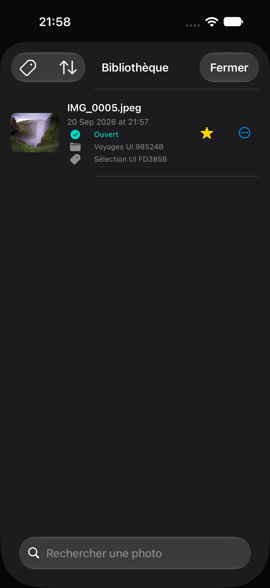
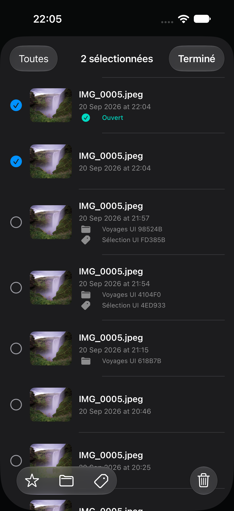

# Bibliothèque locale

Lumora reconstruit la liste de ses documents à partir des dossiers déjà présents dans Application Support. Chaque entrée conserve l’original privé immuable et son sidecar `edits.json` ; aucun catalogue central des photos n’est nécessaire. Les sidecars illisibles, incompatibles ou privés de leur original sont ignorés dans la liste sans empêcher l’ouverture des autres documents.

La feuille **Bibliothèque** affiche les développements avec une miniature ImageIO orientée, le nom de l’original, la date d’import et l’indication **Ouvert**. Une recherche insensible à la casse filtre les noms de fichiers. Le menu de tri propose **Plus récentes**, **Plus anciennes** et **Nom** ; les identifiants des documents départagent les valeurs égales pour garder un ordre stable. Tirer la liste vers le bas reconstruit l’index depuis le disque. Choisir une ligne rend d’abord un aperçu haute qualité ; le document courant n’est remplacé que si ce rendu réussit.

L’étoile de chaque ligne ajoute ou retire le document des favoris. Cet état est conservé dans un petit marqueur `favorite` propre au dossier du document, séparé de `edits.json` afin qu’une sauvegarde asynchrone des réglages ne puisse pas l’écraser.

Le sélecteur de portée affiche toutes les photos, les favoris, un dossier ou une étiquette choisis. **Gérer les dossiers…** permet de créer et supprimer les dossiers ; le menu de chaque photo l’affecte à un dossier ou la remet dans **Sans dossier**. Le catalogue `folders.json` conserve même les dossiers vides, tandis que chaque affectation reste dans le marqueur `folder.txt` du document. Supprimer un dossier retire ces marqueurs sans supprimer aucune photo ni retouche.

Les étiquettes forment un classement transversal : une photo conserve au plus un dossier, mais peut porter plusieurs étiquettes. **Gérer les étiquettes…** crée, compte et supprime les entrées du catalogue racine `tags.json`. La liste d’identifiants propre à chaque document est enregistrée dans son fichier `tags.json`, indépendamment des réglages. Le menu d’une photo active ou retire chaque étiquette sans fermer le menu. Supprimer une étiquette nettoie toutes ses affectations sans supprimer les photos, les retouches, les favoris ou les dossiers.

Le mode **Sélectionner** ajoute des coches à la liste et une barre d’actions. **Toutes/Aucune** agit sur le résultat visible après portée, recherche et tri. Les photos choisies peuvent être ajoutées ou retirées des favoris, déplacées ensemble dans un dossier, recevoir ou perdre une étiquette, ou être supprimées après une confirmation unique. Le magasin valide d’abord tous les documents et le dossier ou l’étiquette cible avant de commencer une opération de classement groupée.

Le menu de chaque ligne permet une suppression définitive après confirmation. Cette opération retire la copie privée de l’original, le sidecar et la sélection `last.txt` lorsque le document était ouvert. Le magasin mémorise aussi les identifiants supprimés pendant la session afin qu’une ancienne sauvegarde asynchrone ne puisse pas recréer leur sidecar.

Le dernier document ouvert reste restauré automatiquement au lancement. Les révisions de sauvegarde continuent d’augmenter lorsque l’utilisateur change de document, ce qui préserve la protection contre les écritures arrivant dans le désordre.

La bibliothèque reste privée à l’installation de l’app. Elle ne propose pas encore d’import en lot, synchronisation iCloud ou corbeille récupérable.

## Validation

Les tests du magasin importent deux originaux, modifient leurs dates et réglages, vérifient le tri, la recherche, la persistance d’un favori, le cycle création → affectation → filtrage → suppression d’un dossier, ainsi que plusieurs étiquettes sur une même photo et leur suppression non destructive. Un test groupé applique puis retire favori, dossier et étiquette sur deux documents avant leur suppression commune. Ils rechargent aussi un développement, suppriment le document sélectionné puis tentent une écriture périmée après suppression. Ce bilan initial portait sur 82 tests ; le dernier passage du cœur compte 97 tests réussis (22 septembre 2026), voir [le protocole de validation](../Docs/VISUAL_VALIDATION.md).

Le parcours XCTest importe une photo depuis le sélecteur système, ouvre la bibliothèque, bascule son favori, crée un dossier puis une étiquette, affecte les deux à la photo et filtre la liste sur chaque portée. La capture finale vérifie aussi l’icône d’étiquette dans le sélecteur. Résultat : `/tmp/LumoraLibraryTagsUI-v2.xcresult`.

Le parcours ciblé de sélection importe deux photos, les coche, applique **Ajouter aux favoris**, puis vérifie les deux états après la sortie du mode. Résultat : `/tmp/LumoraBatchSelectionUI.xcresult`.

