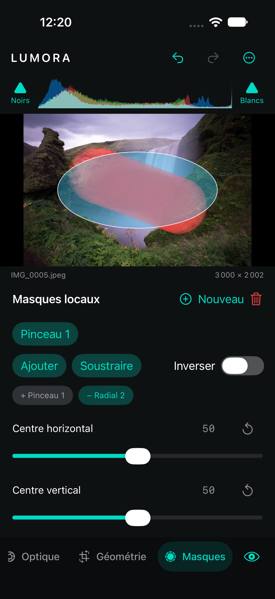

# Masques et calques de modification

## Modèle non destructif

Chaque `AdjustmentLayer` possède un identifiant stable, un nom, une visibilité, une opacité, une liste ordonnée de composantes, une inversion et son propre `LocalAdjustmentState`. Une composante contient une forme **Pinceau**, **Linéaire**, **Radial** ou une matte intelligente et une opération **Ajouter** ou **Soustraire**. Le modèle complet est Codable, Sendable et Equatable ; il est enregistré dans le sidecar, participe à Undo/Redo et ne modifie jamais l’original.

Les coordonnées et dimensions sont normalisées entre 0 et 1. Une retouche peinte sur l’aperçu conserve donc sa position sur l’export pleine résolution. Les collections sont bornées à 16 masques, 32 composantes par masque, 128 traits par pinceau et 4096 points par trait afin qu’un sidecar corrompu ou excessif ne provoque pas une consommation incontrôlée.

## Formes et composition

- **Pinceau** : dessin ou effacement direct sur la photographie avec taille, contour progressif, débit et opacité. Les points reçus pendant le geste sont interpolés selon le rayon afin d’éviter des trous lorsque le doigt se déplace vite. Un cercle rouge pour Peindre ou cyan pour Effacer indique le diamètre actif.
- **Dégradé linéaire** : centre, angle et largeur de transition réglables.
- **Dégradé radial** : centre, largeur, hauteur et contour progressif réglables.
- **Sujet / Arrière-plan** : Vision segmente les instances au premier plan. Lumora fusionne toutes les instances pour Sujet et inverse cette matte pour Arrière-plan.
- **Personne** : Vision segmente uniquement les silhouettes humaines et Lumora fusionne toutes les personnes détectées.
- **Visage** : Vision détecte tous les visages et Lumora produit pour chacun une ellipse agrandie au bord progressif.
- **Ciel** : une analyse locale conserve les régions bleues ou nuageuses plausibles qui restent reliées au haut de l’image.
- **Peau** : les visages détectés calibrent un modèle chromatique propre à la photographie, ensuite appliqué aux zones compatibles.
- **Ajouter/Soustraire** : les mattes s’unissent par maximum ; une soustraction prend le minimum avec le complément de la composante. **Inverser** retourne le masque composé final.

La composante sélectionnée peut changer d’opération après sa création, être déplacée dans l’ordre de composition ou être supprimée. Lumora conserve toujours au moins une composante par calque ; le bouton de suppression reste donc désactivé pour la dernière. Le radial et le linéaire disposent aussi de [poignées d’édition directe](MaskEditing.md) sur la photographie.

Les mattes utilisent des générateurs et des compositions Core Image, et sont donc évaluées par le contexte Metal lorsqu’il est disponible. L’overlay rouge est dérivé de la matte finale composée plutôt que d’une approximation vectorielle : sa transparence montre exactement les contours progressifs, les traits doux, les zones soustraites, l’inversion et l’opacité du calque.

## Réglages du calque et pipeline

Le premier calque, **Photo entière**, contient le développement global. Chaque masque suivant porte son propre jeu Lumière, Couleur, Courbes, Mélangeur, Grading, Effets et Détail. Les panneaux habituels ciblent le calque sélectionné ; les curseurs affichés dans le panneau Masques restent des raccourcis. Lumora développe l’image à chaque niveau visible, module sa matte avec l’opacité du calque, puis la mélange avec l’image entrante via `CIBlendWithMask`.

Les masques sont évalués après la géométrie. Ce choix garde un espace de coordonnées identique entre le canevas, le sidecar, l’aperçu et l’export même après rotation ou crop. Il évite une transformation inverse approximative des coups de pinceau. Les effets locaux sont ainsi appliqués sur les pixels déjà recadrés.

## Validation et limites

Les tests numériques vérifient migration, bornes, sérialisation, historique, coordonnées normalisées du pinceau, effacement réel d’un trait, orientation du linéaire, douceur et inversion du radial, overlay rouge et alpha progressif, soustraction réelle d’une zone, exposition limitée au masque, matte PNG intelligente, détection du ciel et calibration de la peau sur des mires, courbe/effet/détail portés par un calque, visibilité, opacité, ordre persistant, conservation des dimensions et cohérence aperçu/export. La suite du cœur compte **82 tests réussis**.

Le parcours XCTest dédié passe sur simulateur : création d’un pinceau, renommage, visibilité, opacité, réglage local, trait sur la photographie, déplacement direct d’un radial, zoom ×2 partagé avec ses poignées, contour progressif édité dans l’espace zoomé, changement Ajouter/Soustraire, réordonnancement et suppression/restauration de composantes, restauration après relance et réordonnancement des calques avec Undo/Redo. La compilation iOS réussit sans avertissement Swift ; seul l’avertissement Xcode attendu sur l’absence de dépendance AppIntents demeure.

L’overlay affiche en rouge la matte composée et ses transitions mais n’est pas exporté. Le pinceau et les gradients restent éditables au niveau de zoom courant ; la conversion tient compte du déplacement du canvas. Une poignée orange règle directement le contour progressif des gradients radial et linéaire. Voir [les masques intelligents](SmartMasks.md) pour le stockage, la concurrence et les limites de Vision sur simulateur.
