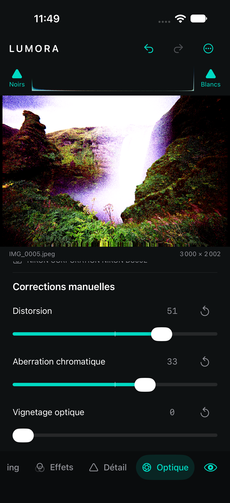

# Optique — huitième étape

## Profil constructeur

Le panneau **Optique** interroge le fichier réellement ouvert. Pour un RAW compatible, `CIRAWFilter.isLensCorrectionSupported` active le contrôle **Profil constructeur**. La correction est activée par défaut, conformément au développement Apple, et peut être désactivée. Ce choix fait partie de `EditState`, de l’historique et du cache de décodage : changer le contrôle redécode donc le RAW au niveau d’aperçu approprié.

Pour un JPEG, HEIC, PNG ou TIFF déjà développé, iOS n’expose pas un profil constructeur réglable équivalent. Le contrôle est alors désactivé et l’interface l’explique explicitement. Lumora ne déduit pas un profil à partir du seul nom de l’objectif et ne prétend pas corriger automatiquement un fichier sans données exploitables.

Lorsque les champs existent, le panneau affiche le fabricant/modèle du boîtier et le modèle de l’objectif lus dans TIFF/EXIF. Ces informations sont descriptives ; elles ne déclenchent pas une correction inventée.

## Corrections manuelles

- **Distorsion**, −100…100, applique une transformation radiale centrée couvrant la diagonale de l’image. Les deux signes permettent de compenser une tendance en barillet ou en coussinet. L’image est recadrée à son étendue initiale et les bords sont prolongés pour éviter la transparence.
- **Aberration chromatique**, −100…100, déplace très légèrement et en sens opposé les canaux rouge et bleu autour du centre optique, tout en gardant le vert comme référence. L’alpha original est conservé. Le signe permet d’inverser la direction des franges.
- **Vignetage optique**, 0…100, éclaircit progressivement les angles. Ce réglage correctif est distinct de la vignette créative du panneau Effets, qui peut éclaircir ou assombrir.

Ces corrections sont appliquées après le décodage et l’orientation, avant balance des blancs, exposition et couleur. Elles utilisent Core Image et le contexte Metal lorsque disponible. Le même état pilote l’aperçu et l’export pleine résolution.

## Modèle et cache

`OpticsSettings` est Codable, Sendable et Equatable. Les documents existants migrent vers le profil constructeur activé et des corrections manuelles neutres. Les valeurs sont bornées et les valeurs non finies reviennent à zéro.

Les aperçus RAW corrigés et non corrigés ont des clés de cache différentes. Le changement de profil ne peut donc pas réutiliser silencieusement le mauvais décodage. Les fichiers déjà développés conservent le chemin ImageIO existant.

## Validation et limites

Les **52 tests du cœur** passent. Quatre nouveaux tests vérifient migration, JSON partiel, bornes, historique, lecture des métadonnées boîtier/objectif, absence honnête de profil sur un TIFF, modification radiale, séparation des canaux, correction des angles, reset exact et conservation des dimensions. Le test de cohérence aperçu/export inclut désormais Optique.

Le parcours XCTest complet de l’éditeur passe également sur simulateur iOS. Il vérifie que le profil constructeur est désactivé pour le JPEG de test, modifie la distorsion et l’aberration chromatique, contrôle Undo/Redo, puis relance l’application pour confirmer la persistance. La compilation Xcode finale réussit sans avertissement Swift.

La correction manuelle de distorsion est un modèle radial générique, pas un profil calibré par focale. La correction chromatique traite l’aberration latérale globale ; elle ne mesure pas automatiquement les franges locales. Aucun fichier RAW réel à profil constructeur n’est inclus dans les fixtures : la branche `CIRAWFilter` compile et suit l’API Apple, mais sa qualité et sa disponibilité doivent encore être validées avec plusieurs boîtiers sur appareil physique.
