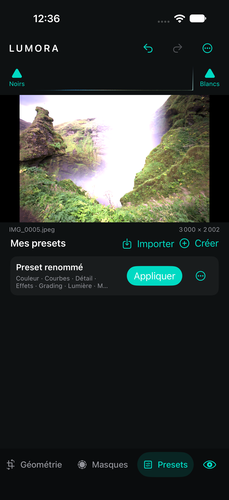

# Presets

## Format partiel et application

Un `Preset` contient un UUID, un nom, une date de création, un `formatVersion`, les valeurs capturées et l’ensemble explicite des groupes sélectionnés. Les groupes disponibles sont Lumière, Couleur, Courbes, Mélangeur, Grading, Effets, Détail, Optique, Géométrie, Masques et Creative.

Appliquer un preset remplace uniquement les groupes sélectionnés. Par exemple, un preset Lumière + Effets conserve la température, le recadrage et tous les masques déjà présents sur la photographie. L’application produit une seule commande d’historique, reste annulable/rétablissable et déclenche le même rendu haute qualité que les autres changements.

Lors de la création, Lumora sélectionne par défaut les groupes photographiques Lumière, Couleur, Courbes, Mélangeur, Grading, Effets, Détail et Creative. Optique, Géométrie et Masques restent décochés car ils dépendent souvent du fichier ou de la composition. L’utilisateur peut néanmoins les inclure explicitement.

## Presets Creative intégrés

Le catalogue Creative propose des snapshots complets par effet, indépendants des presets personnels du document. Une modification de paramètre affiche **Custom** ; revenir exactement aux valeurs d’un preset le reconnaît à nouveau. Appliquer un look conserve l’identité de l’effet, son masque et sa position dans la pile.

Le format document est en version 2, avec lecture des versions 1 et 2. Le groupe Creative capture la pile ; les liens de masques ne sont portables que si le groupe Masques est aussi inclus. Sans lui, les références sont supprimées et l’application dans l’éditeur peut cibler le calque sélectionné. Voir [l’intégration](../Docs/CREATIVE_FX.md).

## Bibliothèque et échange

La bibliothèque est enregistrée dans Application Support, dans un fichier atomique par preset. L’interface permet de créer, renommer, supprimer et appliquer les presets. Elle utilise les sélecteurs système pour importer ou exporter un JSON nommé `Nom.lumorapreset.json`.

Un import valide la taille maximale de 5 Mo, le JSON, la version, le nom et la présence d’au moins un groupe. Il attribue ensuite un nouvel UUID et une nouvelle date afin de ne jamais écraser silencieusement un preset local portant le même identifiant. Les valeurs importées passent par la validation complète d’`EditState`, y compris les limites de masques et de géométrie.

## Validation et limites

Quatre tests vérifient l’application partielle, l’inclusion volontaire de la géométrie et des masques, la sérialisation/version, ainsi qu’un cycle réel création → lecture → renommage → export JSON → import → suppression sur disque. Ce bilan de la onzième étape portait sur 82 tests. Le dernier passage du cœur, le 22 septembre 2026, compte **97 tests réussis** ; les bancs Creative ajoutent notamment Preset/Custom, restauration exacte et Undo/Redo.

Le parcours XCTest dédié crée un preset depuis une exposition modifiée, réinitialise la photo, applique le preset, vérifie Undo/Redo, le renomme, relance l’application pour vérifier sa persistance puis le supprime.

Les presets sont actuellement privés à l’installation de l’app, hors import/export manuel. Les looks intégrés du catalogue Creative sont disponibles. La bibliothèque de presets personnels n’a pas encore de synchronisation iCloud, de dossiers ou d’aperçu miniature avant application.
